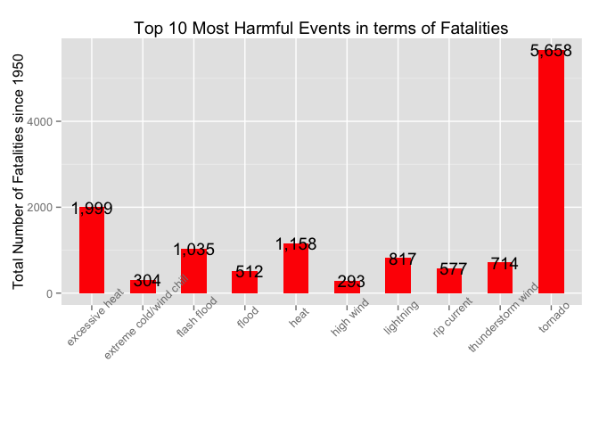
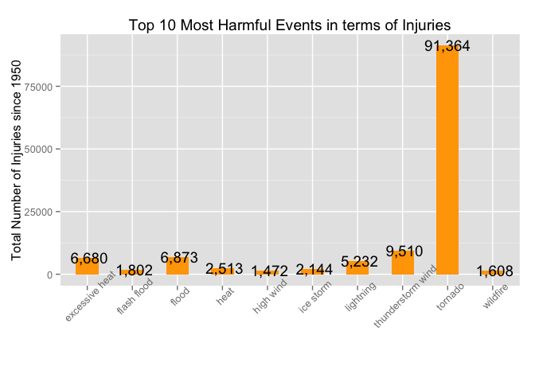
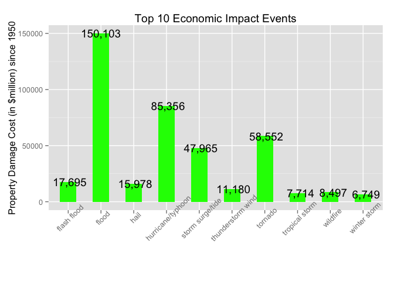

# Peer Asseessment 2: Most Harmful and Economic Impact Weather Events
Tamer Koksal  
May 17, 2015  

***

### Synopsis

This project involves exploring the U.S. National Oceanic and Atmospheric Administration's (NOAA) storm database as to what types of weather events are most harmful to population health and have the greatest economic consequences. The storm database is firstly cleaned and prepared for analysis. Being harmful to population health is measured through the number of fatalities and number of injuries. Economic consequences are measured through the cost of property damage. As a result of the analysis, most harmful events to population health in terms of fatalities have been found to be tornado, excessive heat, heat, and flash flood. In terms of injuries, most harmful weather events are tornado, thunderstorm wind, flood, excessive heat, and lightning. Events having the greatest economic consequences have been found to be flood, hurricane/typhoon, tornado, and storm surge/tide.

***

## 1. Introduction

The purpose of this assignment is to analyze U.S. National Oceanic and Atmospheric Administration's (NOAA) data of major storm and weather events and determine what types of events are most harmful to population health and have the greatest economic consequences. The data keeps the record of major weather events in the United States since 1950 through November 2011.

First we begin by downloading the data from the link provided in the assignment page. According to [National Weather Service Storm Data Documentation](https://d396qusza40orc.cloudfront.net/repdata%2Fpeer2_doc%2Fpd01016005curr.pdf) events should be classified into one of 48 weather event categories. However, when the data is examined one can see that there are approximately 900 different types of events. So, event types are recoded and classified into one of these 48 categories based on the instructions in the documentation. Finally, after processing and tidying the data, the top 10 events with respect to total number of fatalities, total number of injuries, and total cost of property damage are determined, respectively.

## 2. Data Processing


```r
# Load requrired libraries:
library(data.table)
library(dplyr)
```

```
## 
## Attaching package: 'dplyr'
## 
## The following objects are masked from 'package:data.table':
## 
##     between, last
## 
## The following object is masked from 'package:stats':
## 
##     filter
## 
## The following objects are masked from 'package:base':
## 
##     intersect, setdiff, setequal, union
```

```r
library(ggplot2)

# Download data:
fileUrl <- "https://d396qusza40orc.cloudfront.net/repdata%2Fdata%2FStormData.csv.bz2"
download.file(fileUrl, destfile = "/Users/tamer/Documents/COURSERA/DataScienceTrack/5.ReproducibleResearch/PeerAssessment2/stormdata.csv.bz2", method = "curl")

# Read data into R-data frame
stormdata <- read.csv("/Users/tamer/Documents/COURSERA/DataScienceTrack/5.ReproducibleResearch/PeerAssessment2/stormdata.csv.bz2")

# Convert 'stormdata' into data.table for faster data processing
stormdata <- data.table(stormdata)
```

After downloading and reading data into an R data frame, we convert the data into a `data.table`. `data.table` behaves just like a `data.frame`, yet it offers much faster data processing. The data is stored in `stormdata`.

As noted above [National Weather Service Storm Data Documentation](https://d396qusza40orc.cloudfront.net/repdata%2Fpeer2_doc%2Fpd01016005curr.pdf) instructs classifying events into one of 48 weather event categories. Now let's explore how many different event types are present in the data set.


```r
# Explore how many different event types:
length(levels(stormdata$EVTYPE))
```

```
## [1] 985
```

Thus there are 985 variety of event types in the data. So, events that fall outside the specified set of 48 events are examined and recoded into one of these 48 event categories. In doing so the following procedure is followed. Firstly, if the name of the *event type* is self explanatory, the event is recoded accordingly. However, if it is not possible to classify the event just by looking to its event type name, then the description of the event, which is provided under the variable `REMARKS` is examined to determine the type of the event. The following piece of code is used to examine the description of cases with a particular event type name. For instance, if the name of the event type begins with `WIN` followed by some optional set of characters and/or white space, and then followed by `MIX` (e.g. `WINTRY MIX`, `WINTER MIX`, etc.), the following code is used to list such cases:


```r
# Convert all values/observations of EVTYPE to uppercase
stormdata$EVTYPE <- as.character(as.factor(toupper(stormdata$EVTYPE)))

# Requires dplyr package loaded
filter(stormdata, grepl("^WIN.*MIX", EVTYPE, perl = TRUE)) %>% select(EVTYPE, BGN_DATE, END_DATE, REMARKS) %>% head(3)
```

```
##        EVTYPE           BGN_DATE           END_DATE
## 1: WINTRY MIX 12/14/1995 0:00:00 12/14/1995 0:00:00
## 2: WINTRY MIX 12/14/1995 0:00:00 12/14/1995 0:00:00
## 3: WINTRY MIX 12/14/1995 0:00:00 12/14/1995 0:00:00
##                                                                                                                                                                                                                                                                                                                                                                                                                                                                                                                                                                                                                                                                                                                                                                                                     REMARKS
## 1: A low pressure system moved through the Great lakes and its associated warm front brought a wintry mix of snow, sleet and freezing rain mainly to Northern Delaware on the 14th.  Precipitation started as snow across the area a little after midnight on the 14th.  As warmer air moved in aloft the snow changed to sleet and freezing rain between 3 and 6 am across the northern half of the state and to plain rain in the southern half of the state.  Precipitation ended during the morning hours.  Snowfall accumulations averaged one to three inches in New Castle County (1.5 inches in Wilmington), an inch or less in Kent County and little, if any, in Sussex County.  While the freezing rain during the day made traveling slippery, the snow underneath it provided some traction.  
## 2:                                               A low pressure system moved through the Great Lakes and its associated warm front brought a wintry mix of snow, sleet and freezing rain mainly in Cecil County on the 14th.  Precipitation started as snow across the area around midnight on the 14th.  As warmer air moved in aloft the snow changed to sleet and freezing rain between 3 and 6 am across Cecil County, but fairly quickly across the rest of the Eastern Shore.  Precipitation ended during the morning hours.  Snowfall accumulations averaged one to two inches in Cecil County, about an inch in Kent and Queen Anne's Counties and little if any farther south along the Eastern Shore.  The freezing rain made traveling slippery, but the initial snow provided some traction.   
## 3:
```


Using the above explained procedure, the following code is produced to reduce the number of different event categories to 48:


```r
### Reduce the number of event types to 48

# 0. DELETING UNKNOWN, NON-DEFINED  AND UNCLASSIFIABLE EVENTS
stormdata <- filter(stormdata, !grepl("^\\?|^LACK OF SNOW|^LARGE WALL CLOUD|^MILD.*PATTERN|^MONTHLY|^NEAR RECORD|^NONE|^NO SEVERE|^NORMAL PRECIP|^NORTHERN LIGHTS|^OTHER|^PROLONG|^RECORD|^RED FLAG|^ROTATING WALL CLOUD|^SEASONAL SNOW|^SEVERE TURBULENCE|^SOUTHEAST|^TEMPERATURE RECORD|^UNSEASONABLY WET|^UNUSUALLY LATE SNOW|^WAKE LOW WIND|^WALL CLOUD$|^WET (YEAR|MONTH)", EVTYPE, perl = TRUE))

# 1. ASTRONOMICAL LOW TIDE
stormdata$EVTYPE[grep("^BLOW-OUT TIDE", stormdata$EVTYPE, perl = TRUE)] <- "ASTRONOMICAL LOW TIDE"             

# 2. AVALANCHE
stormdata$EVTYPE[grep("^AVALANCE", stormdata$EVTYPE, perl = TRUE)] <- "AVALANCHE"        

# 3. BLIZZARD
stormdata$EVTYPE[grep("^BLIZZARD|^BLOWING SNOW|^GROUND BLIZZARD", stormdata$EVTYPE, perl = TRUE)] <- "BLIZZARD"        

# 4. COASTAL FLOOD
stormdata$EVTYPE[grep("^ASTRONOMICAL HIGH TIDE|HIGH TIDES|(COASTAL|COASTAL/TIDAL|TIDAL)\\s*FLOOD|^COASTAL EROSION|^COASTAL SURGE|CSTL FLOOD", 
                    stormdata$EVTYPE, perl = TRUE)] <- "COASTAL FLOOD"

# 5. COLD/WIND CHILL
stormdata$EVTYPE[grep("^COLD|^COOL|^UNUSUALLY COLD|^RECORD\\s+(COLD|COOL)|^(EXCESSIVE|EXTENDED) COLD|^EARLY RAIN|^HYP|^LOW (WIND CHILL|TEMPERATURE)|^UNSEASON.*(COLD|COOL)|^UNSEASONAL LOW TEMP", stormdata$EVTYPE, perl = TRUE)] <- "COLD/WIND CHILL"        

# 6. DEBRIS FLOW
stormdata$EVTYPE[grep("^LANDSLIDE|^LANDSLUMP|^MUD|^ROCK SLIDE", stormdata$EVTYPE, perl = TRUE)] <- "DEBRIS FLOW"        

# 7. DENSE FOG
stormdata$EVTYPE[grep("^(PATCHY DENSE )?FOG", stormdata$EVTYPE, perl = TRUE)] <- "DENSE FOG"        

# 8. DENSE SMOKE
stormdata$EVTYPE[grep("^SMOKE", stormdata$EVTYPE, perl = TRUE)] <- "DENSE SMOKE"        

# 9. DROUGHT
stormdata$EVTYPE[grep("^DROUGHT|^DRY|^DRIEST MONTH|^ABNORMALLY DRY|^BELOW NORMAL PRECI|^(EXCESSIVELY|UNSEASONABLY|VERY|WARM) DRY( CONDITIONS)?", stormdata$EVTYPE, perl = TRUE)] <- "DROUGHT"        

# 10. DUST DEVIL
stormdata$EVTYPE[grep("^DUST DEV|^LANDSPOUT|^WHIRLWIND", stormdata$EVTYPE, perl = TRUE)] <- "DUST DEVIL"  

# 11. DUST STORM
stormdata$EVTYPE[grep("^DUSTSTORM|^(BLOWING|SAHARAN) DUST|^DUST STORM", stormdata$EVTYPE, perl = TRUE)] <- "DUST STORM"        

#12. EXCESSIVE HEAT
stormdata$EVTYPE[grep("^EXCESSIVE HEAT|^EXTREME HEAT|^EXCESSIVE$|^RECORD HIGH|^RECORD HEAT|^RECORD WARM|^RECORD/EXCESSIVE HEAT", 
                   stormdata$EVTYPE, perl = TRUE)] <- "EXCESSIVE HEAT"        

# 13. EXTREME COLD/WIND CHILL
stormdata$EVTYPE[grep("^EXTREME COLD|^EXTREME/RECORD COLD|^SEVERE COLD|^EXTREME WIND\\s*CHILL|^BITTER WIND CHILL", stormdata$EVTYPE, perl = TRUE)] <- "EXTREME COLD/WIND CHILL"        

# 14. FLASH FLOOD
stormdata$EVTYPE[grep("FLASH\\s*FLOOD|^MAJOR FLOOD|^FLOOD FLASH|^FLASH|^DAM BREAK", stormdata$EVTYPE, perl = TRUE)] <- "FLASH FLOOD"        

# 15. FLOOD
stormdata$EVTYPE[grep("^(LOCAL |MINOR |RURAL |RIVER (AND STREAM )?|(STREAM |STREET ))?FLOOD|^(BREAKUP|HIGHWAY) FLOODING|^DAM FAILURE|^SMA?LL? STREAM|^URBAN.*SMALL|^URBAN.*FLOOD|^URBAN.*(STR(EA)?M)", stormdata$EVTYPE, perl = TRUE)] <- "FLOOD"        

# 16. FREEZING FOG        

# 17. FROST/FREEZE
stormdata$EVTYPE[grep("^FREEZE|^FROST|^FIRST FROST|^HARD FREEZE|^FREEZING SPRAY|^AGRICULTURAL FREEZE|^BLACK ICE|^DAMAGING FREEZE|^(EARLY|LATE) (FREEZE|FROST)|^PATCHY ICE", stormdata$EVTYPE, perl = TRUE)] <- "FROST/FREEZE"   

# 18. FUNNEL CLOUD
stormdata$EVTYPE[grep("^FUNNEL|^WALL CLOUD/FUNNEL", stormdata$EVTYPE, perl = TRUE)] <- "FUNNEL CLOUD"   

# 19. HAIL
stormdata$EVTYPE[grep("^(NON SEVERE |SMALL )?HAIL|^(DEEP|LATE SEASON) HAIL", stormdata$EVTYPE, perl = TRUE)] <- "HAIL"

# 20. HEAT
stormdata$EVTYPE[grep("^HEAT|^HOT|^ABNORMAL WARMTH|^HIGH TEMPERATURE|(UNSEASON.*|UNUSUAL.*|VERY )(WARM|HOT)|^WARM WEATHER", stormdata$EVTYPE, perl = TRUE)] <- "HEAT"

# 21. HEAVY RAIN
stormdata$EVTYPE[grep("^RAIN|^COASTAL\\s*STORM|^(LOCALLY )?HEAVY RAIN|^HEAVY PRE|^HEAVY SHOWER|^(ABNORMALLY|EXCESSIVE|EXTREMELY|HVY|TORRENTIAL|UNSEASONAL) (WET|RAIN)|^WET WEATHER", stormdata$EVTYPE, perl = TRUE)] <- "HEAVY RAIN"

# 22. HEAVY SNOW
stormdata$EVTYPE[grep("^(HEAVY|EXCESSIVE|MOUNTAIN) SNOW|^HEAVY (LAKE|WET) SNOW|^ACCUMULATED SNOWFALL", stormdata$EVTYPE, perl = TRUE)] <- "HEAVY SNOW"

# 23. HIGH SURF
stormdata$EVTYPE[grep("^(HEAVY|HIGH) SEAS|^(HEAVY|HAZARDOUS) SURF|^(HEAVY|HIGH)\\s+SWELLS|^\\s*HIGH SURF|^(HIGH|ROGUE) WAVE", stormdata$EVTYPE, perl = TRUE)] <- "HIGH SURF"

# 24. HIGH WIND
stormdata$EVTYPE[grep("^HIGH$|^HIGH\\s*WIND|^WND", stormdata$EVTYPE, perl = TRUE)] <- "HIGH WIND"

# 25. HURRICANE
stormdata$EVTYPE[grep("^HURRICANE|^TYPHOON|^BEACH FLOOD|^REMNANTS OF FLOYD", stormdata$EVTYPE, perl = TRUE)] <- "HURRICANE/TYPHOON"

# 26. ICE STORM
stormdata$EVTYPE[grep("^ICE|^ICY ROAD", stormdata$EVTYPE, perl = TRUE)] <- "ICE STORM"

# 27. LAKESHORE FLOOD
stormdata$EVTYPE[grep("^LAKE FLOOD|^HIGH WATER", stormdata$EVTYPE, perl = TRUE)] <- "LAKESHORE FLOOD"

# 28. LAKE-EFFECT SNOW
stormdata$EVTYPE[grep("^LAKE EFFECT", stormdata$EVTYPE, perl = TRUE)] <- "LAKE-EFFECT SNOW"

# 29. LIGHTNING
stormdata$EVTYPE[grep("^LIGHTING|^\\s*LIGHTNING|LIGNTNING", stormdata$EVTYPE, perl = TRUE)] <- "LIGHTNING"

# 30. MARINE HAIL

# 31. MARINE HIGH WIND

# 32. MARINE STRONG WIND
stormdata$EVTYPE[grep("^MARINE MISHAP", stormdata$EVTYPE, perl = TRUE)] <- "MARINE STRONG WIND"

# 33. MARINE THUNDERSTORM WIND
stormdata$EVTYPE[grep("^MARINE TSTM WIND", stormdata$EVTYPE, perl = TRUE)] <- "MARINE THUNDERSTORM WIND"

# 34. RIP CURRENT
stormdata$EVTYPE[grep("^RIP CURRENT", stormdata$EVTYPE, perl = TRUE)] <- "RIP CURRENT"

# 35. SEICHE

# 36. SLEET
stormdata$EVTYPE[grep("^HEAVY MIX|^SLEET|^(LIGHT )?FREEZING (RAIN|DRIZZLE)|^GLAZE", stormdata$EVTYPE, perl = TRUE)] <- "SLEET"

# 37. STORM SURGE/TIDE
stormdata$EVTYPE[grep("^STORM SURGE|^STORM FORCE WINDS|^MARINE ACCIDENT|^ROUGH (SURF|SEAS)", stormdata$EVTYPE, perl = TRUE)] <- "STORM SURGE/TIDE"

# 38. STRONG WIND
stormdata$EVTYPE[grep("^\\s*WIND|^(STRONG|GRADIENT|GUSTY|GUSTY LAKE|NON-SEVERE) WIND|^BEACH ERO", stormdata$EVTYPE, perl = TRUE)] <- "STRONG WIND"

# 39. THUNDERSTORM WIND
stormdata$EVTYPE[grep("SUMMARY|^THU|^(\\s*|NON.)TSTM|^TUNDER|^APACHE|^(DOWN|MICRO)BURST|^DROWNING|^(GUSTY|SEVERE) THUNDERSTORM|^GUSTNADO|^METRO STORM|^RAPIDLY RISING WATER|^WET MICR?OBURST", stormdata$EVTYPE, perl = TRUE)] <- "THUNDERSTORM WIND"

# 40. TORNADO
stormdata$EVTYPE[grep("^TORN", stormdata$EVTYPE, perl = TRUE)] <- "TORNADO"

# 41. TROPICAL DEPRESSION

# 42. TROPICAL STORM
stormdata$EVTYPE[grep("^TROPICAL STORM", stormdata$EVTYPE, perl = TRUE)] <- "TROPICAL STORM"

# 43. TSUNAMI

# 44. VOLCANIC ASH
stormdata$EVTYPE[grep("^VOLCANIC|^VOG", stormdata$EVTYPE, perl = TRUE)] <- "VOLCANIC ASH"

# 45. WATERSPOUT
stormdata$EVTYPE[grep("^\\s*WATER\\s*SPOUT|^WAYTERSPOUT", stormdata$EVTYPE, perl = TRUE)] <- "WATERSPOUT"

# 46. WILDFIRE
stormdata$EVTYPE[grep("^WILD|^(BRUSH|FOREST|GRASS) FIRE", stormdata$EVTYPE, perl = TRUE)] <- "WILDFIRE"

# 47. WINTER STORM
stormdata$EVTYPE[grep("^SNOWSTORM|^WINTER STORM", stormdata$EVTYPE, perl = TRUE)] <- "WINTER STORM"

# 48. WINTER WEATHER
stormdata$EVTYPE[grep("^SNOW|^WINTER WEATHER|^(DRIFTING|EARLY|FALLING|FIRST|LIGHT|LATE(.SEASON)?|MODERATE|WET) SNOW|^(EXCESSIVE|MIXED) PRECIP(ITATION)?|^WINT.*MIX", stormdata$EVTYPE, perl = TRUE)] <- "WINTER WEATHER"
```

Now let's examine whether the number of different *event types* are indeed reduced to 48 by printing the levels of the factor variable `EVTYPE`.


```r
# Examine whether the number of 'event types' are reduced to 48 or not:
stormdata$EVTYPE <- as.factor(stormdata$EVTYPE)
levels(stormdata$EVTYPE)
```

```
##  [1] "ASTRONOMICAL LOW TIDE"    "AVALANCHE"               
##  [3] "BLIZZARD"                 "COASTAL FLOOD"           
##  [5] "COLD/WIND CHILL"          "DEBRIS FLOW"             
##  [7] "DENSE FOG"                "DENSE SMOKE"             
##  [9] "DROUGHT"                  "DUST DEVIL"              
## [11] "DUST STORM"               "EXCESSIVE HEAT"          
## [13] "EXTREME COLD/WIND CHILL"  "FLASH FLOOD"             
## [15] "FLOOD"                    "FREEZING FOG"            
## [17] "FROST/FREEZE"             "FUNNEL CLOUD"            
## [19] "HAIL"                     "HEAT"                    
## [21] "HEAVY RAIN"               "HEAVY SNOW"              
## [23] "HIGH SURF"                "HIGH WIND"               
## [25] "HURRICANE/TYPHOON"        "ICE STORM"               
## [27] "LAKE-EFFECT SNOW"         "LAKESHORE FLOOD"         
## [29] "LIGHTNING"                "MARINE HAIL"             
## [31] "MARINE HIGH WIND"         "MARINE STRONG WIND"      
## [33] "MARINE THUNDERSTORM WIND" "RIP CURRENT"             
## [35] "SEICHE"                   "SLEET"                   
## [37] "STORM SURGE/TIDE"         "STRONG WIND"             
## [39] "THUNDERSTORM WIND"        "TORNADO"                 
## [41] "TROPICAL DEPRESSION"      "TROPICAL STORM"          
## [43] "TSUNAMI"                  "VOLCANIC ASH"            
## [45] "WATERSPOUT"               "WILDFIRE"                
## [47] "WINTER STORM"             "WINTER WEATHER"
```


### Coding property damage values

To be able to compare event types in terms of their economic impact, we need to compare the amounts of property damage. Information about property damage is kept using two variables `PROPDMG` and `PROPDMGEXP` where the latter is used to specify what power of 10 should be used to multiply `PROPDMG` with in order to compute the actual property damage.  

In the below code chunk, you can see the variety of *property damage expressions* and their frequencies in the data.  


```r
# Examine different types of property damage expressions:
pdmgexp <- data.frame(table(stormdata$PROPDMGEXP))
names(pdmgexp) <- c("propdmgexp", "Freq")
head(pdmgexp, 20)
```

```
##    propdmgexp   Freq
## 1             465311
## 2           -      1
## 3           ?      8
## 4           +      5
## 5           0    216
## 6           1     25
## 7           2     13
## 8           3      4
## 9           4      4
## 10          5     28
## 11          6      4
## 12          7      5
## 13          8      1
## 14          B     40
## 15          h      1
## 16          H      6
## 17          K 424655
## 18          m      7
## 19          M  11327
```

Numerical values of `PROPDMGEXP` are self explanatory and correspond to the power value of 10. `h` and `H` correspond to a multiplier of hundred, that is, a power value of 2 ($10^2$). `K` corresponds to a power of 3. `m` and `M` correspond to a power of 6. `B` corresponds to a power of 9. The other values are disregarded in the computation of the actual property damage.


```r
# Requires data.table package loaded

# Property Damage costs: "PROPERTY DAMAGE ACTUAL" = PROPDMGA

stormdata[PROPDMGEXP == "1", PROPDMGA := PROPDMG*10]
stormdata[PROPDMGEXP %in% c("2", "h", "H"), PROPDMGA := PROPDMG*10^2]
stormdata[PROPDMGEXP %in% c("3","K"), PROPDMGA := PROPDMG*10^3]
stormdata[PROPDMGEXP == "4", PROPDMGA := PROPDMG*10^4]
stormdata[PROPDMGEXP == "5", PROPDMGA := PROPDMG*10^5]
stormdata[PROPDMGEXP %in% c("6", "m", "M"), PROPDMGA := PROPDMG*10^6]
stormdata[PROPDMGEXP == "7", PROPDMGA := PROPDMG*10^7]
stormdata[PROPDMGEXP == "8", PROPDMGA := PROPDMG*10^8]
stormdata[PROPDMGEXP == "B", PROPDMGA := PROPDMG*10^9]
stormdata[PROPDMGEXP %in% c("", "-", "?", "+", "0"), PROPDMGA := PROPDMG]
```

Finally, *event types* are converted to lower case for visualization purposes.


```r
# Convert all values/observations of EVTYPE to lower case
stormdata$EVTYPE <- as.factor(tolower(stormdata$EVTYPE))
```

## 3. Analysis Results

Now the data is ready for analysis that will yield answers to the following questions: 

1. Across the United States, which types of events (as indicated in the EVTYPE variable) are most harmful with respect to population health?

2. Across the United States, which types of events have the greatest economic consequences?

In the data there are two measures pertaining to population health: the number of fatalities and the number of injuries. Thus, top 10 most harmful events will be identified in terms of fatalities and injuries separately.

### Most harmful events to population health

#### Top 10 most harmful events in terms of fatalities:

In order to compare event types with respect to the number of fatalities from most serious to least, the data is aggregated/summarized with respect to (grouped by) the variable `EVTYPE` (event type) through summing up the number of fatalities across all years since 1950.


```r
library(printr)

# Compare events w.r.t. fatalities
FAT.SUM <- stormdata[, .(FATALITIES.SUM = sum(FATALITIES)), by = .(EVTYPE)][order(-FATALITIES.SUM)]

head(FAT.SUM, 10) # Top 10 most harmful events
```


EVTYPE                     FATALITIES.SUM
------------------------  ---------------
tornado                              5658
excessive heat                       1999
heat                                 1158
flash flood                          1035
lightning                             817
thunderstorm wind                     714
rip current                           577
flood                                 512
extreme cold/wind chill               304
high wind                             293

The barplot below shows the top 10 most hamrful weather events to population health given the number of fatalities. Tornado has been the most serious event with substantially higher number of fatalities. Tornado is followed by excessive heat, heat, and flash flood.


```r
p1 <- ggplot(FAT.SUM[1:10,], aes(x=EVTYPE, y=FATALITIES.SUM)) 
p1 + geom_bar(stat="identity", fill="red", width=.5) + 
    theme(axis.text.x = element_text(angle=45)) +
    labs(title="Top 10 Most Harmful Events in terms of Fatalities", x="", y="Total Number of Fatalities since 1950") +
    geom_text(aes(y = FATALITIES.SUM, label = format(FATALITIES.SUM, big.mark = ",")))
```

 

#### Top 10 most harmful events in terms of injuries:

Similarly, in order to compare event types with respect to the number of injuries, the data is aggregated/summarized with respect to (grouped by) the variable `EVTYPE` (event type) through summing up the number of injuries across all years since 1950.


```r
library(printr)

# Compare events w.r.t. injuries
INJ.SUM <- stormdata[, .(INJURIES.SUM = sum(INJURIES)), by = .(EVTYPE)][order(-INJURIES.SUM)]

head(INJ.SUM, 10) # Top 10 most harmful events
```


EVTYPE               INJURIES.SUM
------------------  -------------
tornado                     91364
thunderstorm wind            9510
flood                        6873
excessive heat               6680
lightning                    5232
heat                         2513
ice storm                    2144
flash flood                  1802
wildfire                     1608
high wind                    1472

In terms of injuries, tornado is again the leading weather event having the most devastating impact. However, the order of event types following tornado differs from that of fatalities. When injuries are the case, tornado is followed by thunderstorm wind, flood, excessive heat, lightning, etc. 


```r
p2 <- ggplot(INJ.SUM[1:10,], aes(x=EVTYPE, y=INJURIES.SUM)) 
p2 + geom_bar(stat="identity", fill="orange", width=.5) + 
    theme(axis.text.x = element_text(angle=45)) +
    labs(title="Top 10 Most Harmful Events in terms of Injuries", x="", y="Total Number of Injuries since 1950") +
    geom_text(aes(y = INJURIES.SUM, label = format(INJURIES.SUM, big.mark = ",")))
```

 

### Events Having the Greatest Economic Consequences (Top 10)

In order to identify the events of highest economic cost, the data is aggregated/summarized with respect to (grouped by) the variable `EVTYPE` (event type) through summing up the property damage across all years since 1950. In other words, for each event type, the total property damage cost since 1950 is computed. For visualization/graphing purposes, the total property damage values are divided by $10^6$. 


```r
library(printr)

# Compare events w.r.t. property damage
PDAM.SUM <- stormdata[, .(PDAMAGE.SUM = sum(PROPDMGA), PDMGE06.SUM = round(sum(PROPDMGA)/10^6)), by = .(EVTYPE)][order(-PDAMAGE.SUM)]

head(PDAM.SUM, 10) # Top 10 property damage events
```


EVTYPE                PDAMAGE.SUM   PDMGE06.SUM
------------------  -------------  ------------
flood                150102777379        150103
hurricane/typhoon     85356410010         85356
tornado               58552152376         58552
storm surge/tide      47964984000         47965
flash flood           17694804096         17695
hail                  15977540013         15978
thunderstorm wind     11179853350         11180
wildfire               8496628500          8497
tropical storm         7714390550          7714
winter storm           6748997251          6749

When the event types are ordered in decreasing order in terms of property damage, flood has had the greatest economic cost. Flood is followed by hurricane/typhoon, tornado, and storm surge/tide. 


```r
p3 <- ggplot(PDAM.SUM[1:10,], aes(x=EVTYPE, y=PDMGE06.SUM)) 
p3 + geom_bar(stat="identity", fill="green", width=.5) + 
    theme(axis.text.x = element_text(angle=45)) +
    labs(title="Top 10 Economic Impact Events", x="", y="Property Damage Cost (in $million) since 1950") +
    geom_text(aes(y = PDMGE06.SUM, label = format(PDMGE06.SUM, big.mark = ",")))
```

 
